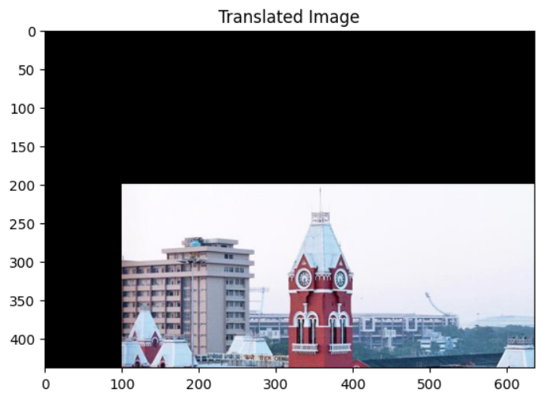
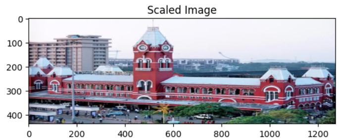
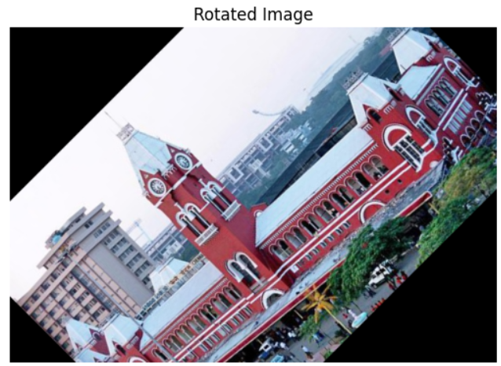
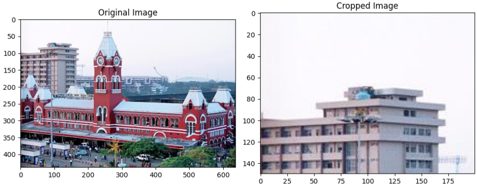

# IMAGE-TRANSFORMATIONS

## Aim
To perform image transformation such as Translation, Scaling, Shearing, Reflection, Rotation and Cropping using OpenCV and Python.

## Software Required:
Anaconda - Python 3.7

## Algorithm:
### Step1:
Import necessary libraries such as OpenCV, NumPy, and Matplotlib for image processing and visualization.
<br>

### Step2:
Read the input image using cv2.imread() and store it in a variable for further processing.
<br>

### Step3:
Apply various transformations like translation, scaling, shearing, reflection, rotation, and cropping by defining corresponding functions
<br>

### Step4:
Display the transformed images using Matplotlib for visualization. Convert the BGR image to RGB format to ensure proper color representation.
<br>

### Step5:
Save or display the final transformed images for analysis and use plt.show() to display them inline in Jupyter or compatible environments.
<br>

## Program:

### Developed By: Bharath Raj P
### Register Number: 212223230031
```
import cv2
import numpy as np
import matplotlib.pyplot as plt
image = cv2.imread('Chennai_Central.jpg')
plt.imshow(image[:,:,::-1])
plt.title('Original Image')
plt.show()
```
### i)Image Translation
```
tx, ty = 100, 200
M_translation = np.float32([[1, 0, tx], [0, 1, ty]]) 
translated_image = cv2.warpAffine(image, M_translation, (636, 438)) 
plt.imshow(translated_image[:,:,::-1])
plt.title("Translated Image")
plt.axis('on')
plt.show()
```

### ii) Image Scaling
```
fx, fy = 2.0, 1.0  
scaled_image = cv2.resize(image, None, fx=fx, fy=fy, interpolation=cv2.INTER_LINEAR)
plt.imshow(scaled_image[:,:,::-1]) 
plt.title("Scaled Image") 
plt.axis('on')
plt.show()
```

### iii)Image shearing
```
shear_matrix = np.float32([[1, 0.5, 0], [0.5, 1, 0]])  
sheared_image = cv2.warpAffine(image, shear_matrix, (636, 438))
plt.imshow(sheared_image[:,:,::-1])
plt.title("Sheared Image") 
plt.axis('on')
plt.show()
```

### iv)Image Reflection

```
reflected_image = cv2.flip(image, 2) 
plt.figure(figsize=(10, 5))
plt.subplot(1, 2, 1)
plt.imshow(image[:, :, ::-1])
plt.title("Original Image")
plt.axis('off')
plt.subplot(1, 2, 2)
plt.imshow(reflected_image[:,:,::-1])
plt.title("Reflected Image")
plt.axis('off')
plt.tight_layout()
plt.show()
```

### v)Image Rotation
```
(height, width) = image.shape[:2] 
angle = 45
center = (width // 2, height // 2)
M_rotation = cv2.getRotationMatrix2D(center, angle, 1)
rotated_image = cv2.warpAffine(image, M_rotation, (width, height))
plt.imshow(cv2.cvtColor(rotated_image, cv2.COLOR_BGR2RGB))  # Display the rotated image
plt.title("Rotated Image")  # Set title
plt.axis('off')
```

### vi)Image Cropping
```
image.shape  
x, y, w, h = 0, 0, 200, 150  
cropped_image = image[y:y+h, x:x+w] 
plt.figure(figsize=(10, 5))
plt.subplot(1, 2, 1)
plt.imshow(image[:, :, ::-1])
plt.title("Original Image")
plt.axis('on')
plt.subplot(1, 2, 2)
plt.imshow(cropped_image[:,:,::-1])
plt.title("Cropped Image")
plt.axis('on')
plt.tight_layout()
plt.show()

```
## Output:
### i)Image Translation


### ii) Image Scaling



### iii)Image shearing


### iv)Image Reflection


### v)Image Rotation



### vi)Image Cropping


## Result: 

Thus the different image transformations such as Translation, Scaling, Shearing, Reflection, Rotation and Cropping are done using OpenCV and python programming.
